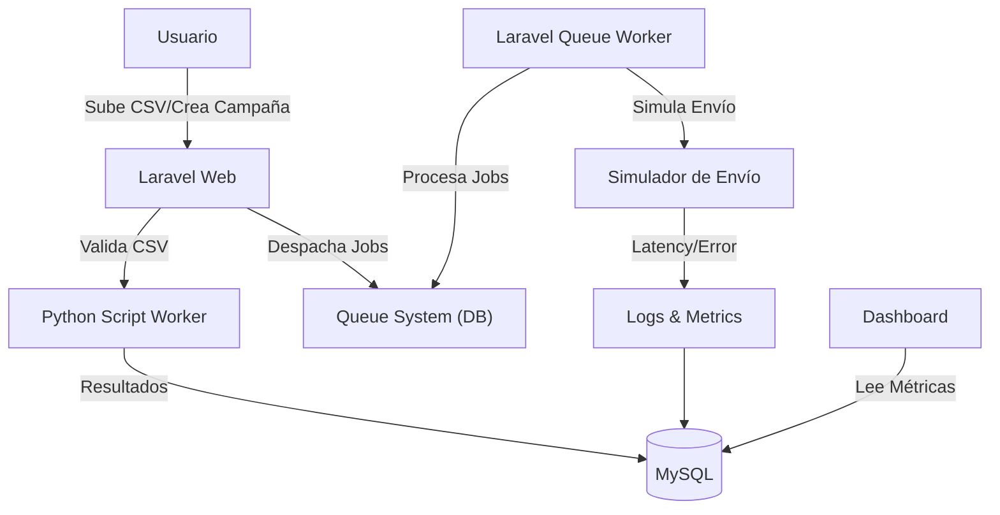

# Sistema de Email Marketing Automatizado (Portfolio Demo)

## 📌 Descripción del Proyecto
Esta es una **Demo Técnica** diseñada para demostrar capacidades avanzadas en arquitectura backend, procesamiento asíncrono y alta concurrencia utilizando un stack gratuito y moderno.

El sistema simula el envío masivo de correos electrónicos (Sistema de Email Masivo), gestionando campañas, listas de contactos y métricas en tiempo real, todo sin enviar un solo correo real para evitar spam y costes, pero ejecutando toda la lógica de validación, encolamiento y procesamiento.

### 🚀 Objetivos de la Demo
- **Performance**: Procesar miles de simulaciones por minuto.
- **Resiliencia**: Manejo de fallos, reintentos automáticos y backoff exponencial en colas.
- **Escalabilidad**: Arquitectura desacoplada lista para escalar horizontalmente.
- **Validación Avanzada**: Integración con Python para procesamiento pesado de datos.

## 🛠 Tech Stack (100% Free Tier Compatible)

### Backend
- **Framework**: Laravel 11 (PHP 8.2)
- **Queue Driver**: Database (Optimizado para demostración sin Redis)
- **Scheduler**: Cron simulado (Laravel Scheduler)
- **Validación**: Python 3 (Scripts externos)

### Frontend
- **Interface**: Blade Templates
- **Estilos**: Tailwind CSS 3
- **Gráficos**: Chart.js (Visualización en tiempo real)
- **Interacción**: Vanilla JS (Sin frameworks pesados)

### Infraestructura (Demo)
- **Base de Datos**: MySQL / MariaDB (Compatible con Railway/Render/InfinityFree)
- **Deploy**: Dockerfile incluido para despliegue en Railway/Render/Fly.io.

## 🏗 Arquitectura del Sistema

### 🧠 ¿Por qué NO se envían correos reales?
1.  **Seguridad y Reputación**: Enviar 10k correos de prueba dañaría la reputación de IPs y dominios.
2.  **Costos**: Servicios como SendGrid/AWS SES tienen costos o límites estrictos en free tier.
3.  **Foco en Ingeniería**: El desafío técnico está en el *procesamiento*, *encolado* y *concurrencia*, no en la llamada API a un SMTP.

## 📊 Base de Datos y Optimización
El esquema está diseñado para minimizar bloqueos y maximizar throughput en entornos limitados:

- **`campaigns`**: Estado maestro de la campaña.
- **`contacts`**: Lista global de contactos (validada).
- **`email_jobs`**: Tabla de "tareas" para desacoplar la lógica de negocio de la tabla `jobs` del framework.
- **`email_logs`**: Tabla de auditoría particionable en el futuro.
- **Indices**: Optimizados para queries de agregación (COUNT, AVG) en el dashboard.

## ⚙️ Cómo Desplegar (Deploy)

### Requisitos Previos
- PHP 8.2+
- Composer
- MySQL/MariaDB
- Python 3

### Instalación Local
1.  Clonar el repositorio.
2.  `composer install`
3.  `npm install && npm run build`
4.  Configurar `.env` (DB_CONNECTION, etc).
5.  `php artisan migrate --seed` (Crea usuario demo y 10k contactos).
6.  `php artisan serve`
7.  En otra terminal: `php artisan queue:work --tries=3 --timeout=90`

### Producción (Railway/Render)
1.  Conectar repositorio.
2.  Configurar Variables de Entorno.
3.  El `Dockerfile` o `Procfile` se encargará de levantar Nginx/PHP y el Worker.

---
**Autor**: [Isaac-Villegas-Dev]
**Versión**: 1.0.0
